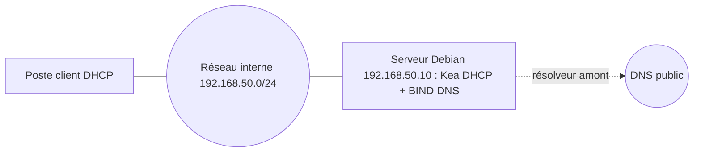

# Lab Linux : DHCP (Kea) et DNS (BIND 9) sur Debian

> **Statut : à réaliser.** Ce guide est préparé à partir de la documentation officielle et de mes cours ; **je ne l'ai pas encore rejoué de bout en bout**. Les commandes sont à valider en le faisant, et le journal en bas de page sera complété avec mes résultats réels (captures, erreurs rencontrées, corrections).
>
> **Commandes vérifiées :** les commandes de ce guide ont été rejouées telles quelles dans des conteneurs Debian 12 et 13 (22 septembre 2026), avec les vrais BIND 9 et Kea : `kea-dhcp4 -t` valide la configuration, `named-checkconf`/`named-checkzone` valident les deux zones, et BIND répond correctement à de vraies requêtes `dig` (le CNAME `www` puis l'A du serveur, la zone inverse, l'enregistrement du serveur DNS lui-même). Vérifié ne veut pas dire réalisé : c'est l'assistant IA qui a préparé ce guide qui a rejoué ces commandes dans un conteneur jetable, pas moi sur mon propre lab. Le journal ci-dessous reste à remplir une fois que je l'aurai fait moi-même.

## Objectif

Installer sur un serveur Debian les deux services de base d'un réseau d'entreprise :

- **DHCP** (Kea) : distribuer adresse, passerelle et DNS aux postes ;
- **DNS** (BIND 9) : résoudre les noms internes du domaine `lab.local` (zone directe et zone inverse).

## Prérequis

- Une machine virtuelle **Debian 12** (VirtualBox) avec une carte en réseau interne (`192.168.50.10/24`) et un poste client dans le même réseau interne.
- **Aucun autre serveur DHCP** sur ce réseau (désactiver celui de VirtualBox).
- Voir aussi : [serveur-debian-lemp-securise](https://github.com/mehdiseg/serveur-debian-lemp-securise) pour préparer le serveur.

## Topologie



| Élément | Valeur |
|---|---|
| Réseau | 192.168.50.0/24 |
| Serveur (DHCP + DNS) | 192.168.50.10 |
| Passerelle | 192.168.50.1 |
| Plage DHCP | 192.168.50.100 à 192.168.50.200 |
| Domaine | lab.local |

## Étapes

### 1. DHCP avec Kea

```bash
sudo apt update && sudo apt install -y kea-dhcp4-server
```

Fichier du dépôt : [`configs/kea-dhcp4.conf`](configs/kea-dhcp4.conf)

```json
{
  "Dhcp4": {
    "interfaces-config": { "interfaces": [ "enp0s8" ] },
    "lease-database": { "type": "memfile", "lfc-interval": 3600 },
    "valid-lifetime": 3600,
    "subnet4": [
      {
        "id": 1,
        "subnet": "192.168.50.0/24",
        "pools": [ { "pool": "192.168.50.100 - 192.168.50.200" } ],
        "option-data": [
          { "name": "routers", "data": "192.168.50.1" },
          { "name": "domain-name-servers", "data": "192.168.50.10" },
          { "name": "domain-name", "data": "lab.local" }
        ]
      }
    ]
  }
}
```

Remplacer `enp0s8` par le nom réel de l'interface (`ip -br a`). Installer ce contenu dans `/etc/kea/kea-dhcp4.conf`, puis tester **avant** de redémarrer :

```bash
sudo kea-dhcp4 -t /etc/kea/kea-dhcp4.conf     # vérifie la syntaxe
sudo systemctl restart kea-dhcp4-server
sudo systemctl status kea-dhcp4-server
```

### 2. DNS avec BIND 9

```bash
sudo apt install -y bind9 dnsutils
```

Déclarer les zones dans `/etc/bind/named.conf.local` :

Fichier du dépôt : [`configs/named.conf.local`](configs/named.conf.local)

```text
zone "lab.local" {
    type master;
    file "/etc/bind/db.lab.local";
};
zone "50.168.192.in-addr.arpa" {
    type master;
    file "/etc/bind/db.192.168.50";
};
```

Zone directe `/etc/bind/db.lab.local` (penser à **incrémenter le numéro de série** à chaque modification) :

Fichier du dépôt : [`configs/db.lab.local`](configs/db.lab.local)

```text
$TTL 86400
@   IN SOA ns1.lab.local. admin.lab.local. (
        2026092101 ; série
        3600       ; rafraîchissement
        1800       ; nouvel essai
        604800     ; expiration
        86400 )    ; TTL négatif
@       IN NS  ns1.lab.local.
ns1     IN A   192.168.50.10
srv     IN A   192.168.50.20
www     IN CNAME srv
```

Zone inverse `/etc/bind/db.192.168.50` :

Fichier du dépôt : [`configs/db.192.168.50`](configs/db.192.168.50)

```text
$TTL 86400
@   IN SOA ns1.lab.local. admin.lab.local. (
        2026092101 3600 1800 604800 86400 )
@   IN NS  ns1.lab.local.
10  IN PTR ns1.lab.local.
20  IN PTR srv.lab.local.
```

Limiter la récursion au réseau interne dans `/etc/bind/named.conf.options`, à l'intérieur du bloc `options` :

```text
    allow-recursion { 192.168.50.0/24; localhost; };
    forwarders { 1.1.1.1; };
```

## Vérifications

```bash
sudo named-checkconf
sudo named-checkzone lab.local /etc/bind/db.lab.local
sudo named-checkzone 50.168.192.in-addr.arpa /etc/bind/db.192.168.50
sudo systemctl restart bind9

dig @192.168.50.10 www.lab.local +short      # -> srv.lab.local. puis 192.168.50.20
dig @192.168.50.10 -x 192.168.50.20 +short   # -> srv.lab.local.
sudo cat /var/lib/kea/kea-leases4.csv       # baux accordés (fichier de la base « memfile »)
```

Sur le client : renouveler le bail et vérifier qu'il reçoit une adresse entre `.100` et `.200`, la passerelle `.1`, le DNS `.10`, et que `ping www.lab.local` fonctionne.

## Pièges fréquents

- Nom d'interface incorrect dans Kea : le service démarre mais ne répond à personne.
- Deux serveurs DHCP sur le même réseau (celui de la box, celui de VirtualBox).
- Numéro de série de la zone non incrémenté : les modifications ne sont pas prises en compte par les serveurs secondaires.
- Oubli du point final dans les noms d'un fichier de zone (`ns1.lab.local.`) : BIND ajoute le domaine une seconde fois.
- Pare-feu qui bloque UDP 67 (DHCP) ou UDP/TCP 53 (DNS).

## Pour aller plus loin

- Ajouter un **DNS secondaire** et un transfert de zone (`allow-transfer`).
- Réservations DHCP (`reservations`) pour les imprimantes et serveurs.
- Mettre à jour le DNS automatiquement depuis DHCP (DDNS).
- Observer les échanges DORA dans Wireshark : [tp-wireshark-analyse-trafic](https://github.com/mehdiseg/tp-wireshark-analyse-trafic).

## Références

- [Documentation de Kea](https://kea.readthedocs.io/en/latest/)
- [Documentation de BIND 9](https://bind9.readthedocs.io/en/latest/)

## Journal de réalisation

_Lab pas encore réalisé : cette section sera remplie au fur et à mesure._

| Date | Ce que j'ai fait | Résultat | Difficultés et solutions |
|---|---|---|---|
|  |  |  |  |

## Feuille de route

Ce lab fait partie de ma [feuille de route réseau](https://github.com/mehdiseg/roadmap-reseau-bts-sio).
